# Fractal Flame

Fractal Flame is a microservice web application for generating, previewing, storing, and sharing fractal flame images.

The system combines an interactive Vue frontend, an HTTP API gateway, a Go-based IAM service, and a Java/Spring generator service. Fractal generation runs asynchronously, while the browser receives live progress updates and base64 preview frames through Server-Sent Events.

## Features

- Interactive fractal flame generation with configurable image size, iteration count, symmetry level, gamma correction, affine transformations, colors, weights, and variation functions.
- Live rendering previews streamed to the frontend while a generation task is running.
- Public feed with pagination, sorting, author names, and generated image cards.
- User registration, login, access/refresh tokens, profile editing, password updates, and profile image upload.
- Personal gallery for the current user's generated works.
- OpenAPI-based HTTP contracts and gRPC communication between backend services.
- PostgreSQL persistence for users and fractal metadata, with MinIO used for profile images and generated PNG files.

## Architecture

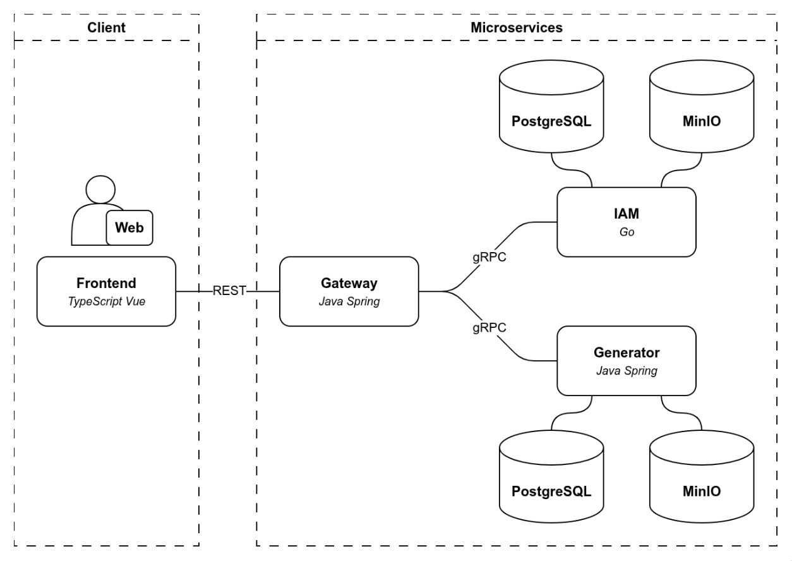

The application consists of four main services:

- `frontend` - a Vue 3 single-page application for generation, galleries, authentication, and account management.
- `gateway` - a Spring Boot HTTP entry point that exposes `/api/v1`, forwards requests to internal gRPC services, propagates JWT context, and bridges generation updates to SSE.
- `iam` - a Go gRPC service responsible for users, authentication, tokens, profile data, and profile images.
- `generator` - a Spring Boot gRPC service responsible for fractal rendering, generation tasks, progress updates, generated images, and gallery metadata.

The frontend communicates only with the gateway over HTTP. The gateway calls IAM and Generator over gRPC. PostgreSQL stores user and fractal metadata, while MinIO stores profile images and rendered PNG files.

## Frontend

The frontend implements the user-facing workflow as a single-page Vue application. It includes the generation screen, public feed, login, registration, and account pages. The visual style is inspired by the main menu of *Ultrakill*.

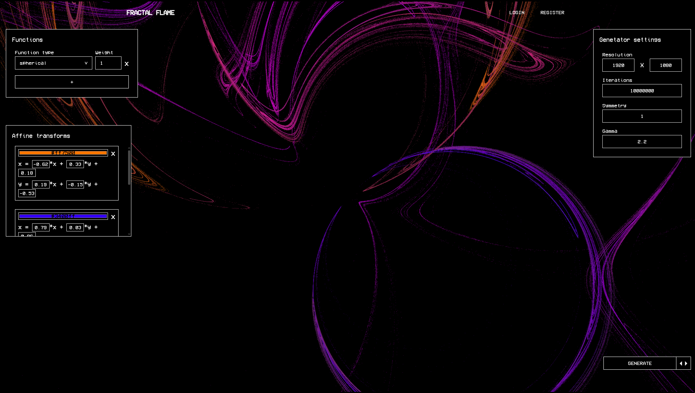

The main generation view is centered around a full-screen fractal preview. Generation parameters are split between two sidebars:

- The left sidebar controls variation functions and affine transformations, including function weights, colors, and affine coefficients `a`, `b`, `c`, `d`, `e`, and `f`.
- The right sidebar controls render-wide settings such as width, height, iteration count, symmetry level, and gamma correction.

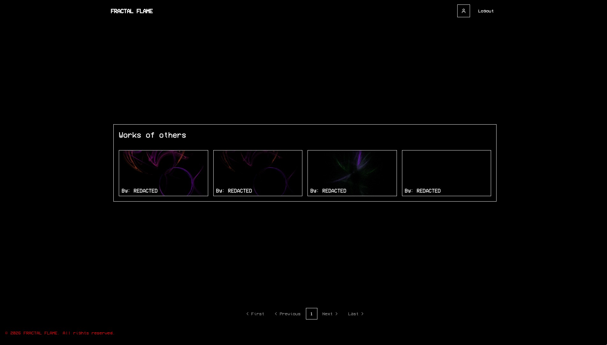

The feed displays recent works sorted by creation date. It fetches fractal pages from the API and resolves user data so that cards can show author names.

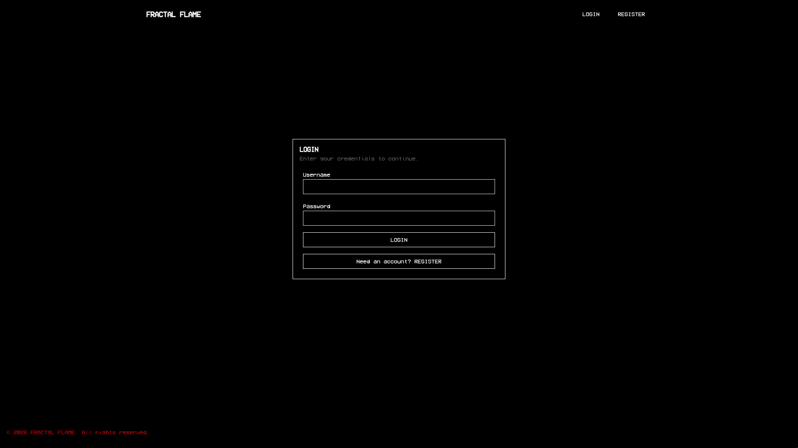

Login and registration are separate routes. Validation errors and invalid credentials are shown next to the relevant form fields.

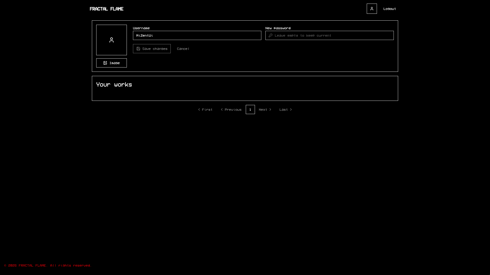

The account page lets users update their username, change their password, upload a profile image, and view their personal "Your works" gallery.

## API Gateway

The API gateway is the public boundary of the backend. It exposes a JSON HTTP API under `/api/v1` and keeps the internal gRPC services behind a single frontend-facing interface.

The external API is described in [openapi.yaml](openapi.yaml). OpenAPI Generator uses this specification to generate Java models and API interfaces, which are implemented by the gateway controllers.

The gateway also propagates user context. The frontend sends the JWT in the `Authorization` header, and the gateway forwards that token through gRPC metadata. This allows Generator to associate created fractals with the current user without exposing Generator directly to the browser.

For long-running generation tasks, the gateway bridges Generator's gRPC task stream to a browser-friendly `SseEmitter` stream.

## IAM

IAM is a separate microservice so that user and token logic stays isolated from image generation.

It provides an internal gRPC API for:

- Registration and login.
- Access token refresh.
- User lookup.
- Username, password, and profile image updates.
- Profile image retrieval.

Authentication is based on JWT. After a successful login, IAM issues an access token and a refresh token. The access token is used by the frontend when calling the gateway. The refresh token allows the session to be renewed without asking the user to log in again.

IAM service logic is split into three main areas:

- `AuthService` registers users, verifies passwords, and issues token pairs.
- `UserService` reads and updates profile data.
- `ImageService` reads profile images from object storage.

Passwords are never stored as plain text. They are checked for complexity and hashed with bcrypt before being written to PostgreSQL. Profile images are accepted as base64 strings, decoded, validated by format and dimensions, and stored in the MinIO `images` bucket.

## Generator

Generator owns the computationally expensive part of the system: fractal rendering, task progress, generated image storage, and generation history.

Its main gRPC contract is described in [generator/src/main/proto/generator.proto](generator/src/main/proto/generator.proto). The `Fractals` service provides operations for:

- Listing fractals with pagination, sorting, and optional filtering by `user_id`.
- Fetching a single fractal by id.
- Creating a generation task.
- Subscribing to task progress.
- Listing available variation functions.
- Reading generated images from S3-compatible storage.

Fractal metadata is stored in PostgreSQL. Rendered PNG files are stored in MinIO through the AWS S3 SDK using the `image/png` content type.

## Fractal Generation

Fractal flame generation is implemented as an iterative rendering process based on affine transformations and nonlinear variation functions.

The user provides image dimensions, iteration count, symmetry level, gamma value, function weights, colors, and affine coefficients. These values are stored as part of the fractal domain model and then used to create a `GenerationTask`.

During rendering, the generator starts from a random point. On every iteration it chooses one affine transformation and one variation function. The affine transformation moves the point, the variation function applies a nonlinear transform, and the symmetry setting creates additional rotated samples. Each resulting point is mapped to an image pixel, blended with the current affine color, and counted as a pixel visit.

The more often a point lands in a region of the image, the brighter that region becomes after normalization. Once worker threads finish their assigned iterations, gamma correction applies logarithmic normalization and adjusts pixel intensity using the selected `gamma` value.

For more background on the algorithm, see the original fractal flame paper: [The Fractal Flame Algorithm](https://flam3.com/flame_draves.pdf).

## Progress Previews

Generation can take noticeable time, so it is implemented as an asynchronous task rather than a blocking HTTP request.

`Generation` stores the parameters, creates a task, puts it into a queue, and returns the initial `TaskState`. `GeneratationService` uses a `BlockingQueue` for pending work and a `ConcurrentHashMap` for tasks that can be observed by subscribers. Worker threads take tasks from the queue, call `generator.process(task)`, save the final PNG to MinIO, update PostgreSQL, and remove completed tasks from the pending map.

`GenerationTask` tracks completed iterations. Its `toTaskState()` method creates a protobuf message containing the fractal id, progress from `0` to `1`, and the current base64 preview image.

A Spring scheduler periodically sends updates for pending tasks. The gateway subscribes to those gRPC updates and forwards every `TaskState` to the browser through SSE. When progress reaches `1`, the gateway completes the SSE stream.

## Configuration

Create a `.env` file in the repository root before starting the stack.

```shell
# JWT signing secrets. Use private base64-encoded values in real deployments.
ACCESS_SIGNING_KEY=BASE64
REFRESH_SIGNING_KEY=BASE64

# IAM
IAM_HOST=0.0.0.0
IAM_PORT=50051

LOGGER_LEVEL=DEBUG
LOGGER_AS_JSON=true

MIN_PASSWORD_ENTROPY=60.0
BCRYPT_COST=15
ACCESS_TOKEN_TTL=15m
REFRESH_TOKEN_TTL=360h

MINIO_HOST=storage-iam
MINIO_PORT=9000
MINIO_ROOT_USER=fractal-flame
MINIO_ROOT_PASSWORD=fractal-flame-password

DB_USER=fractal-flame
DB_PASSWORD=fractal-flame-password
DB_HOST=db-iam
DB_PORT=5432
DB_NAME=fractal

GOOSE_DRIVER=postgres
GOOSE_MIGRATION_DIR=./migrations/

# frontend
IMAGE_HEIGHT=10000000
IMAGE_WIDTH=10000000

API_URL=https://127.0.0.1/api/v1
ALLOWED_ORIGINS=https://127.0.0.1
DOMAIN=127.0.0.1
LTE_SSL_PATH=/etc/letsencrypt
```

Additional Generator settings, such as worker count, thread count, task update delay, and maximum iteration limits, are configured in [generator/src/main/resources/application.yaml](generator/src/main/resources/application.yaml).

Gateway gRPC targets, SSE timeout, JWT signing key, and CORS settings are configured in [gateway/src/main/resources/application.yaml](gateway/src/main/resources/application.yaml).

The frontend nginx image is configured for HTTPS and expects certificates under `${LTE_SSL_PATH}/live/${DOMAIN}` and `${LTE_SSL_PATH}/archive/${DOMAIN}`.

## Usage

Build and start the whole stack:

```shell
docker compose up -d --build
```

Then open [https://127.0.0.1](https://127.0.0.1).

## Gallery

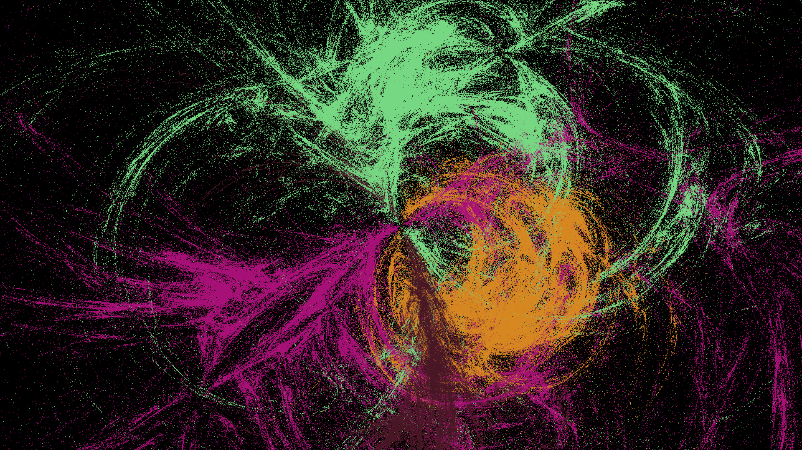


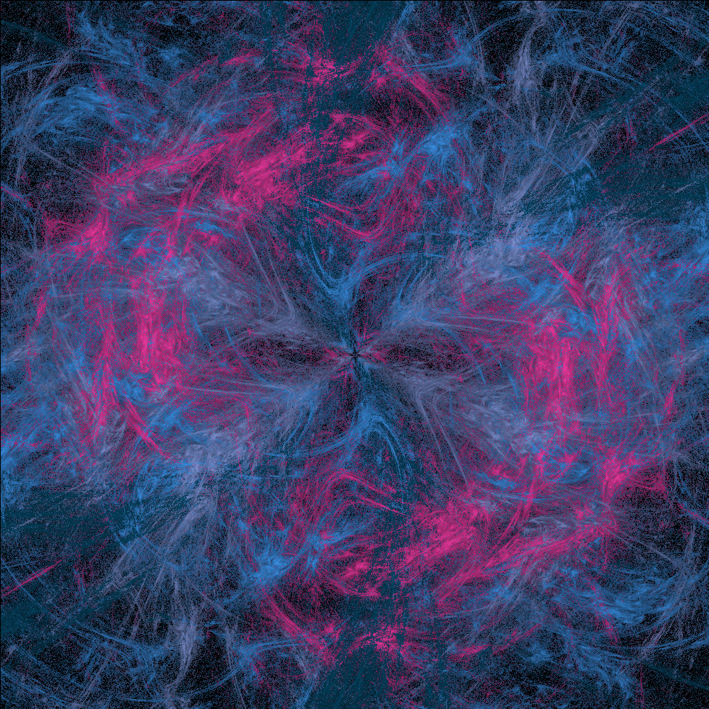

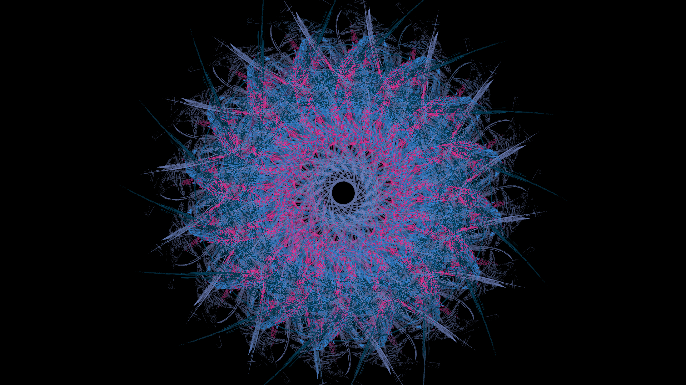

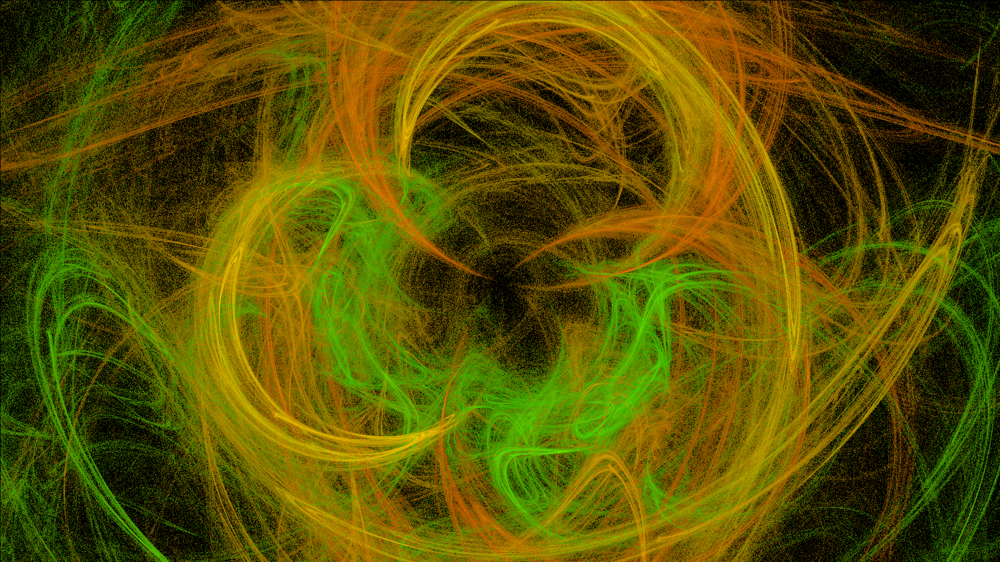

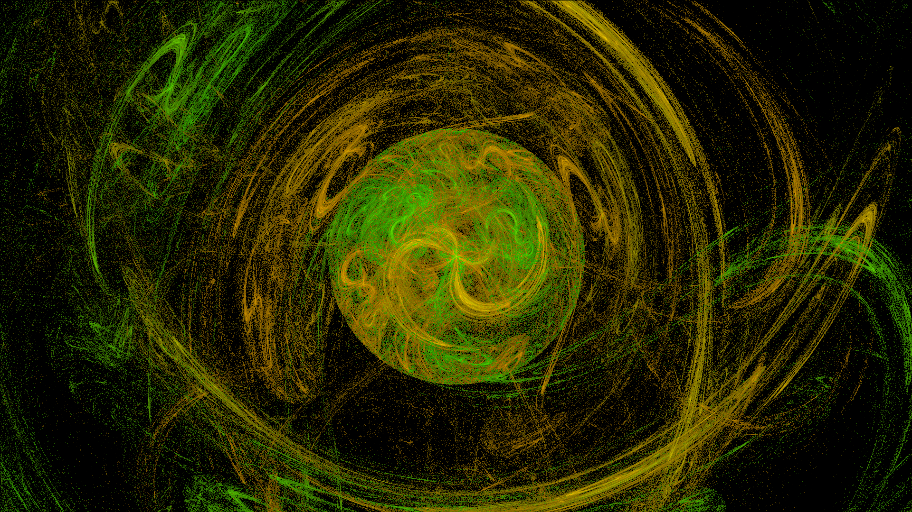

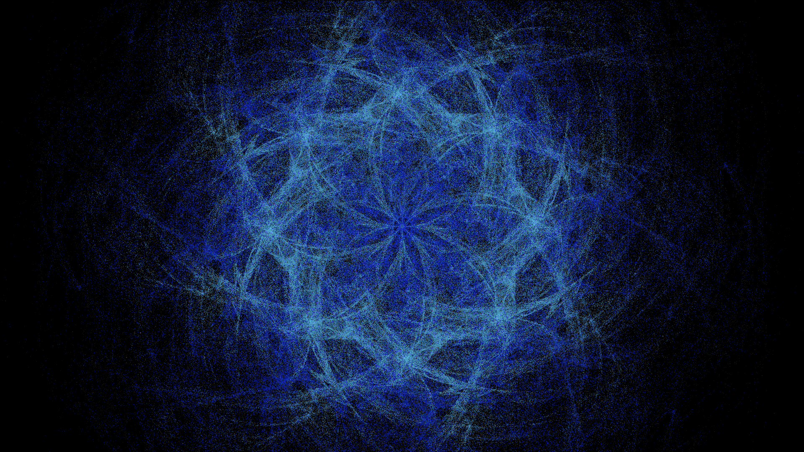

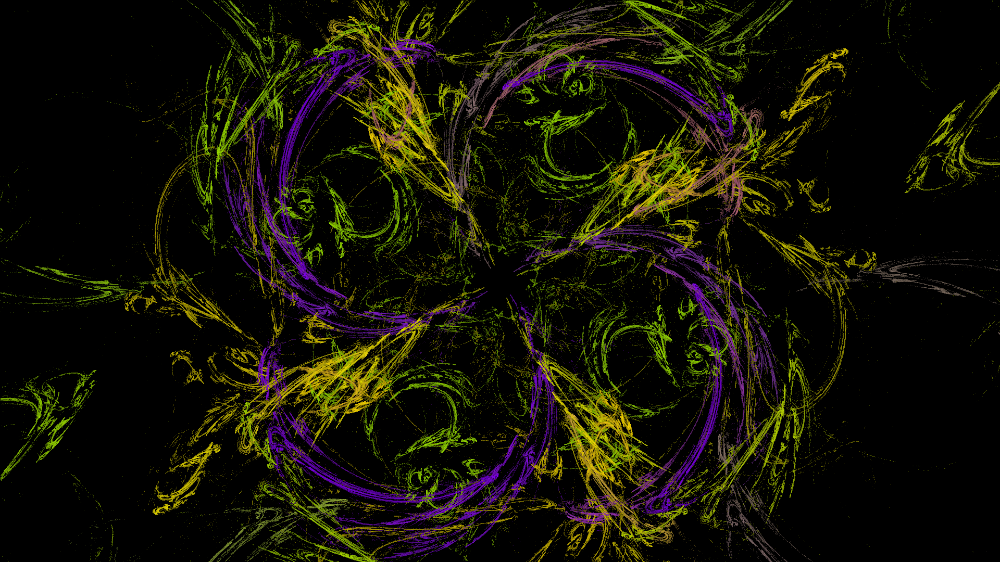

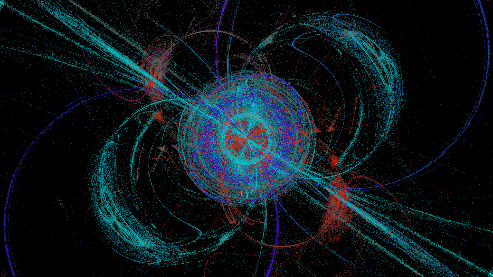
